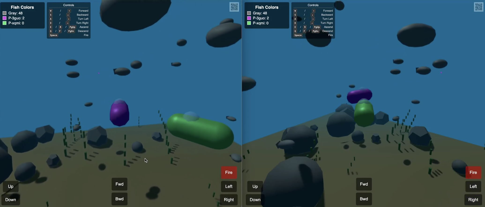

# Vibecoded Multiplayer Submarine Game

_🕹️ [Run the live version](https://multisynq.github.io/vibecoded-submarine)🕹️ then join the session on a second device by copying the private session URL._

This game was vibecoded with Gemini 2.5 Pro in Google AI Studio in less than 2 hours via this initial prompt:

> Based on the multiplayer example code in [this file](https://github.com/multisynq/multicar/blob/main/index.html), create a multiplayer underwater game where you are steering a submarine in a small lake. Each player’s submarine has a different color.  A player can shoot paintballs in their ship’s color. There are a large number of fish swimming around randomly. The fish are gray initially. When a player’s ball hits a fish, the fish’s color turns to that players color. When another player hits it, it turns to the other player’s color. The goal is to turn as many fish your color as you can. There’s a scoreboard showing the number of fish in each player’s color. Make the lake bed interesting visually too with something like plants or rocks.

You can find the whole series of prompts here:
 https://aistudio.google.com/prompts/1Q60DbGaErAE7IwL-vXfW_p3CJ0sZ7Axf

The [Multicar example](https://github.com/multisynq/multicar) is a heavily documented HTML+JS file to guide AIs in properly implementing 3D multiplayer games with Multisynq and ThreeJS.

Deployment of Multisynq games is extremely simple, since there is no server code to deploy. You can see it in this repo which has GitHub Pages enabled – that is all that's needed, there isn't even a build script.

For questions about this, please [follow us on X](https://x.com/multisynq) and join [our Discord](https://multisynq.io/discord).